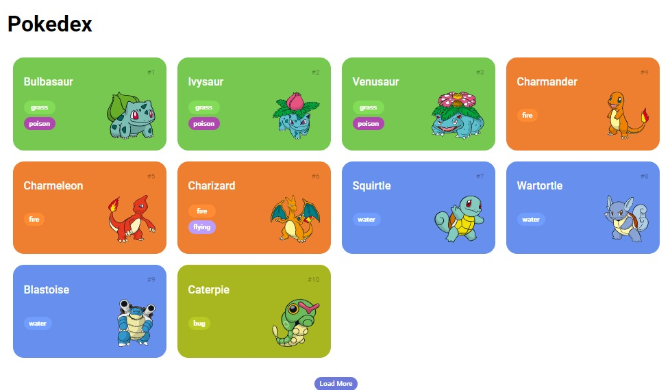

# Pokedex

Pokedex usando PokeApi no Front-end

## 📱 Funcionalidades: 
- Listagem dos Pokemons ate sua segunda geração
- Listagem com páginação em Load More 
- Integração com a PokeApi
- Requisição por método GET

## 🤳 Demonstração:
- Você pode clicar no link abaixo:

  [Pokedex](https://jennimachado.surge.sh)

## 👩🏻‍💻 Imagem do projeto:

!

## 🤖 Tecnologias Utilizadas:

- NodeJs Versão LTS Mais Recente: 18.18.0 (includes npm 9.8.1)
- Package Http-server
- Css
- HTML
- JavaScript

## 👣 Próximos Passos:
- [] Implementação de recursos para visualizar detalhes dos Pokemons

